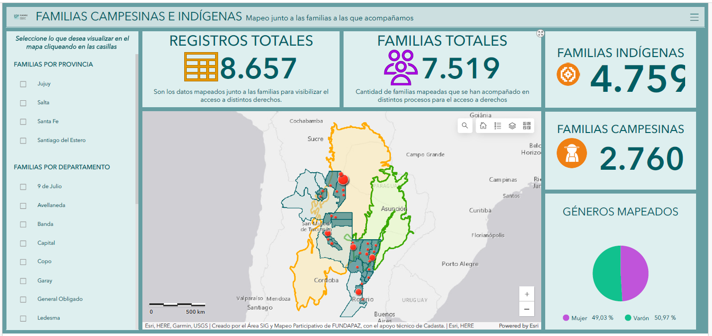
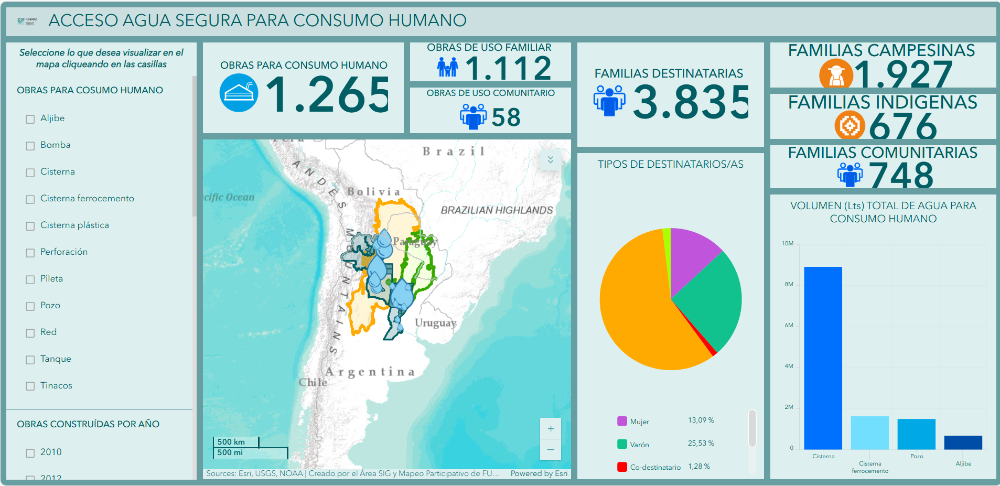
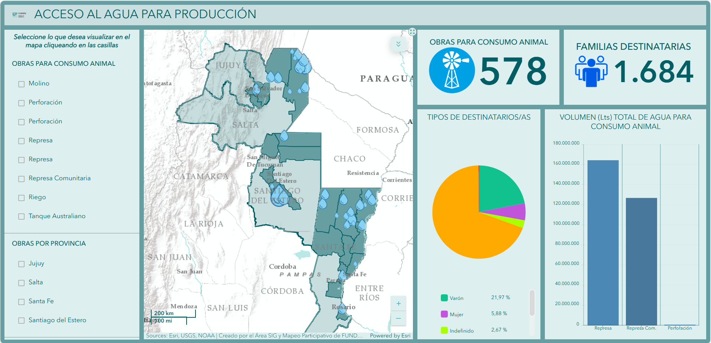
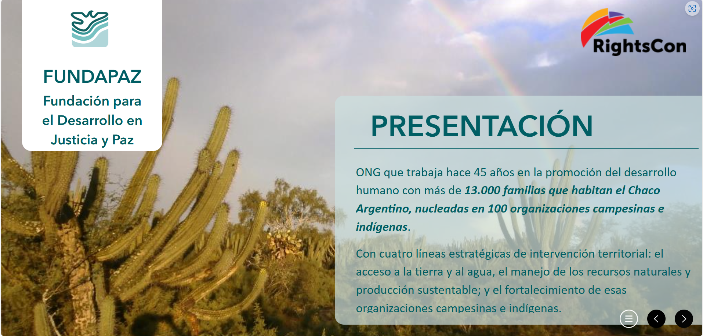
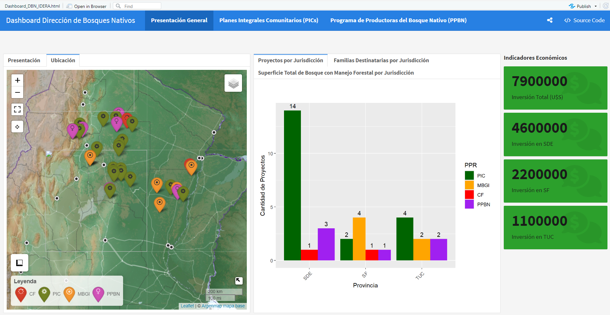

```{r setup, include=FALSE}
knitr::opts_chunk$set(echo = TRUE)
library(flexdashboard)
library(sf)
library(leaflet)
library(dplyr)
library(ggplot2)
library(DT)
library(scales)
library(htmltools)
library(leaflet.extras)
library(leafem)
library(htmlwidgets)
library(leafgl)
library(stringr)
library(shiny)
library(leaflegend)
```

**Presentación**
==================================================================
Column {data-width=70%}
-----------------------------------------------------------------------
### **Presentación**
**Bienvenid@ a mi portafolio interactivo.**  

Me complace que estés aquí. En este espacio, encontrarás información sobre mi trayectoria profesional, así como mis principales proyectos en **Sistemas de Información Geográfica (SIG) y Teledetección**. 

A lo largo de mi carrera, he tenido la oportunidad de trabajar en diversas iniciativas relacionadas con la gestión ambiental y la conservación de recursos naturales, donde he aplicado mis habilidades en análisis de datos y herramientas geoespaciales. 

En este portafolio, podrás explorar mis trabajos más destacados, proyectos colaborativos y estudios de caso, cada uno de los cuales refleja mi pasión por la ecología y mi compromiso con el desarrollo sostenible. 

Te invito a navegar por las distintas secciones, donde encontrarás descripciones detalladas de mis proyectos, metodologías utilizadas y los resultados obtenidos. Estoy entusiasmada por compartir mis experiencias contigo y espero que encuentres la información útil e inspiradora.

### **Sobre Mí**

Soy especialista en Sistemas de Información Geográfica (SIG) y Teledetección, con más de 10 años de experiencia en proyectos ambientales y forestales. Poseo una sólida formación en ecología y conservación, y he desarrollado habilidades avanzadas en herramientas geoespaciales y análisis de datos.

Cuento con amplia experiencia en el procesamiento de imágenes satelitales (Landsat, Sentinel) utilizando software SIG como ArcGIS Pro, QGIS y Google Earth Engine, así como en lenguajes de programación como Python y R. He generado mapas temáticos de alta precisión, realizado análisis de cambios en la cobertura terrestre y llevado a cabo modelados espaciales.

Destaco mis habilidades de liderazgo, trabajo en equipo y comunicación efectiva, lo que me permite coordinar proyectos multidisciplinarios y presentar resultados a audiencias diversas. Estoy en busca de un puesto desafiante donde pueda aplicar mis competencias para contribuir a la conservación de los recursos naturales.


Column {data-width=30%}
-----------------------------------------------------------------------

### **Currículum Vitae**

Puedes descargar mi currículum en el siguiente enlace:  
[Descargar CV](ruta_al_archivo/CV_Paola_Marozzi.pdf)
<div style="text-align: center;">
  {style="width: 150px; border-radius: 50%; margin-top: 10px;"}
</div>

### **Datos de Contacto**
<div style="text-align: left;">
  <p>📧 marozzi.mo.paola@gmail.com</p>
  <p>🌐 <a href="https://www.linkedin.com/in/paolamarozzimo/" target="_blank">LinkedIn</a></p>
  <p>📞 [Llamar: +54 9 385-4881110](tel:+5493854881110)</p>
  <p><i class="fas fa-map-marker-alt"></i> Santiago del Estero, Argentina</p>
</div>


**Productos diseñados con ArcGIS Online**
==================================================================
Column {data-width=50%}
-----------------------------------------------------------------------

### **Producto 1: FAMILIAS CAMPESINAS E INDÍGENAS**

***Descripción:*** Mapeo de la ubicación de las familias campesinas e indígenas que habitan en el Chaco Argentino. Este trabajo incluye a las comunidades con las que colaboramos en diversos procesos, tanto para el acceso a derechos como para mejorar su acceso a los recursos naturales.

***Aplicacion utilizada:*** Dashboards.

<div style="text-align: center;">
  <a href="https://www.arcgis.com/apps/dashboards/2f5cd4684d724249a84595064f7a02b3" target="_blank" 
     title="Link de acceso al Dashboards">
    
  </a>
</div>

### **Producto 2: ACCESO AGUA SEGURA PARA CONSUMO HUMANO**

***Descripción:*** Este herramienta presenta una visualización de las obras de acceso al agua segura para el consumo humano, construidas en los últimos 30 años gracias al trabajo conjunto con las familias campesinas e indígenas del Chaco Argentino con Fundapaz. Además, se destacan las colaboraciones con instituciones estatales y privadas involucradas en el territorio, clave para el desarrollo de procesos que garantizan el acceso al agua segura para las comunidades.

***Aplicacion utilizada:*** Dashboards.

<div style="text-align: center;">
  <a href="https://www.arcgis.com/apps/dashboards/f83153ebf8bc4c79abe060fe069adc81" target="_blank" 
     title="Link de acceso">
    
  </a>
</div>

Column {data-width=50%}
-----------------------------------------------------------------------

### **Producto 3: ACCESO AL AGUA PARA PRODUCCIÓN**

***Descripción:*** Este dashboard ofrece una visualización de las obras de acceso al agua para consumo animal que se han construido en los últimos 30 años, resultado del trabajo en conjunto con las familias campesinas e indígenas del Chaco Argentino con Fundapaz. Se destaca el compromiso y la cooperación en la gestión de recursos hídricos, poniendo de relieve la importancia de estas obras para el bienestar de las comunidades locales.  

***Aplicacion utilizada:*** Dashboards.

<div style="text-align: center;">
  <a href="https://www.arcgis.com/apps/dashboards/66ebe3dcc2254b6eb8bd0ead24f84cee" target="_blank" 
     title="Link de acceso">
    
  </a>
</div>

### **Producto 4: Land as a Human Right: Technology for Rights Documentation and Impact**

***Descripción:*** Esta herramienta se utilizó para crear una presentación en la conferencia internacional RightsCon, incorporando mapas interactivos en las diapositivas. La aplicación Experience Builder de ArcGIS Online permitió integrar diversos elementos geoespaciales, facilitando una experiencia visual dinámica y envolvente para los asistentes.

***Aplicacion utilizada:*** Experience Builder.

<div style="text-align: center;">
  <a href="https://experience.arcgis.com/experience/edd43cd1386f46fba50bc93fdcde5a09/" target="_blank" 
     title="Link de acceso">
    
  </a>
</div>


**Productos diseñados con RStudio**
==================================================================
Column {data-width=50%}
-----------------------------------------------------------------------
### **Proyecto 5: Tablero de control**

***Descripción:*** Tablero de control desarrollado en RStudio para visualizar los avances del Proyecto Pagos por Resultados de REDD+ de la Argentina para el período 2014-2016 (GCP/ARG/029/GCF) en las provincias de Santiago del Estero, Tucumán y Santa Fe. Este tablero facilita la identificación de áreas de éxito y desafíos, lo que ha permitido implementar mejoras significativas en la gestión del proyecto.

***Aplicación utilizada:*** RStudio 2024.12.0+467 Kousa Dogwood.

<div style="text-align: center;">
  <a href="https://pamm-datos.github.io/tableroR/" target="_blank" 
     title="Link de acceso">
    
  </a>
</div>


